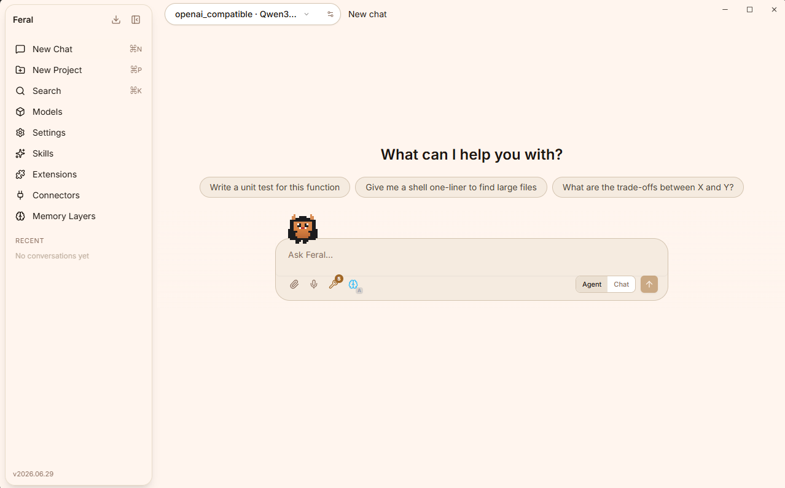
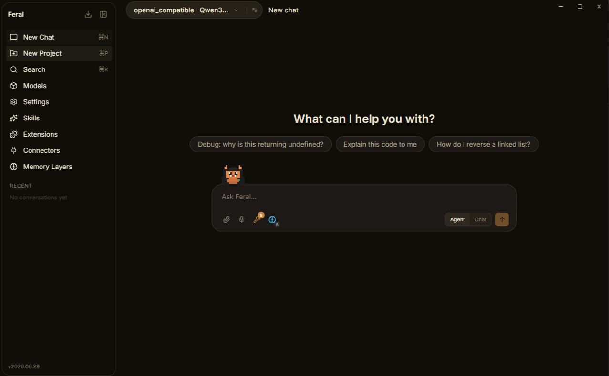
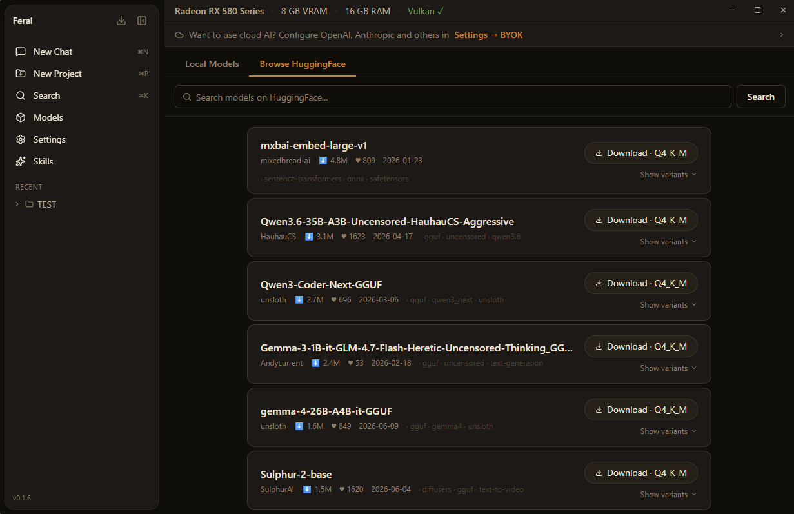
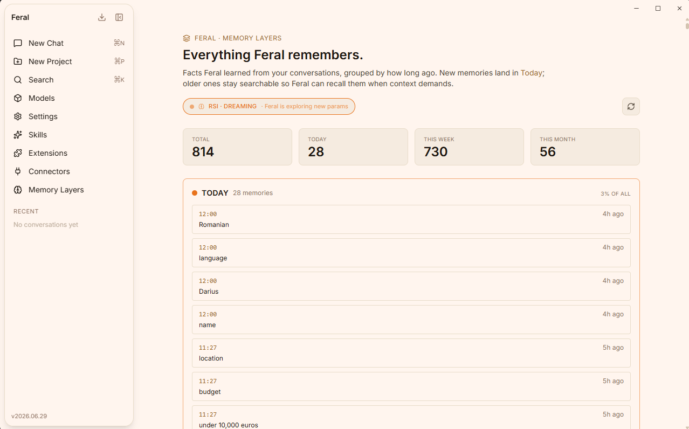
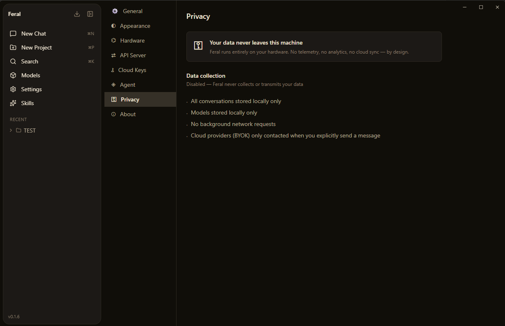
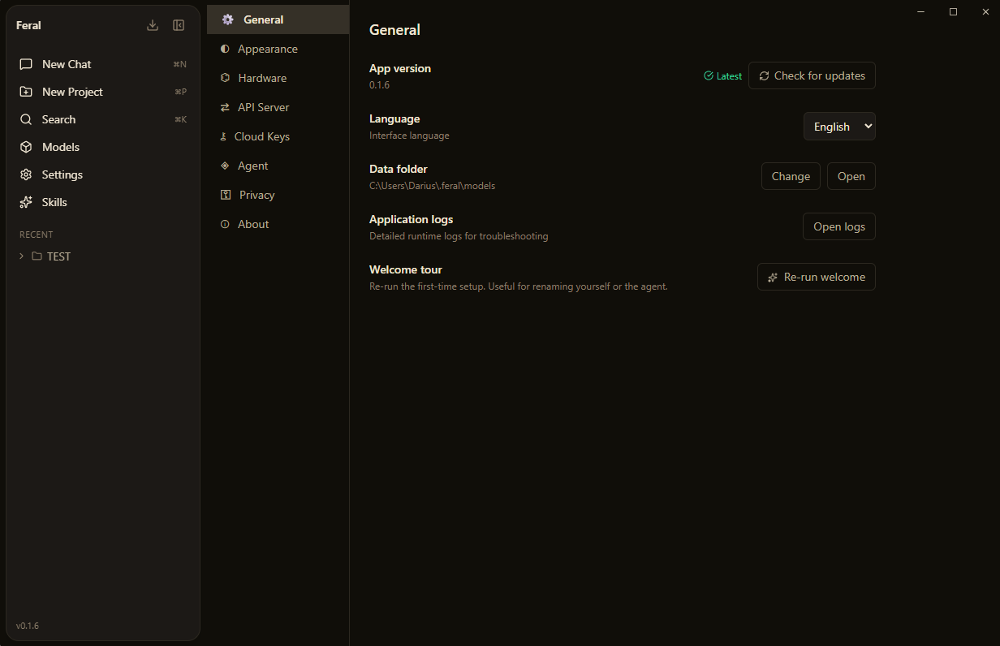
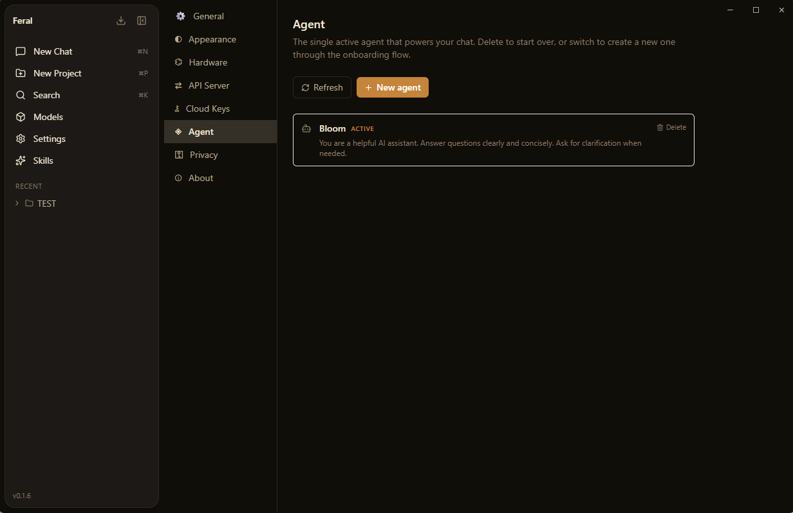

<p align="center">
  
</p>

# Feral

**Your local-first AI workspace. No subscription. No telemetry. No middleman.**

<p align="center">
  <a href="https://github.com/bloom500/feral/releases/latest"></a>
  
  
  
</p>

<p align="center">
  <a href="https://x.com/BloomMedia66730"></a>
  <a href="https://github.com/bloom500/feral"></a>
  <a href="https://github.com/bloom500/feral/discussions"></a>
</p>

[Download](https://github.com/bloom500/feral/releases/latest) · [Report an issue](https://github.com/bloom500/feral/issues) · [Discussions](https://github.com/bloom500/feral/discussions) · Discord: *coming soon* · Website: *coming soon*

---

Feral is a desktop app that runs AI on your machine. With local GGUF models, everything happens offline — no API bills, no data leaving your computer, and absolutely zero VC-funded "alignment" teams reading your conversations at 3am. Prefer frontier models? Plug in your own API keys (BYOK) and talk to OpenAI, Anthropic, Gemini and friends directly — your key, your bill, no proxy in between. Either way: chat, deploy a full agentic runtime with memory and tool-use, and run deep multi-step web research. It's your computer. Do whatever you want.



---

## Quick install

One command per platform. Each grabs the latest release automatically — no version numbers to update.

**Linux — Debian / Ubuntu** (desktop app, `.deb`)

```bash
curl -s https://api.github.com/repos/bloom500/feral/releases/latest \
  | grep -oP '"browser_download_url": "\K[^"]*amd64\.deb(?=")' \
  | xargs curl -LO && sudo apt install ./Feral_*_amd64.deb
```

**Linux — Fedora / RHEL** (desktop app, `.rpm`)

```bash
curl -s https://api.github.com/repos/bloom500/feral/releases/latest \
  | grep -oP '"browser_download_url": "\K[^"]*x86_64\.rpm(?=")' \
  | xargs curl -LO && sudo dnf install ./Feral-*.x86_64.rpm
```

**Windows 10/11** (PowerShell)

```powershell
$u = (irm https://api.github.com/repos/bloom500/feral/releases/latest).assets |
  Where-Object name -like '*x64-setup.exe' | ForEach-Object browser_download_url
irm $u -OutFile feral-setup.exe; .\feral-setup.exe
```

> SmartScreen may warn on first run (the installer isn't code-signed yet) — click **More info → Run anyway**.

**macOS** (Apple Silicon — for Intel replace `aarch64` with `x64`)

```bash
curl -s https://api.github.com/repos/bloom500/feral/releases/latest \
  | sed -n 's/.*"browser_download_url": "\(.*aarch64\.dmg\)".*/\1/p' | xargs curl -LO
open Feral_*.dmg     # drag Feral to Applications, then clear the quarantine flag:
xattr -cr /Applications/Feral.app
```

**Headless server / CLI** (`feral gateway` on a VPS — build from source; no GPU or llama.cpp compile needed, requires [Rust](https://rustup.rs) + [Bun](https://bun.sh))

```bash
# Build deps (Debian/Ubuntu). libdbus-1-dev is needed by the keyring crate:
sudo apt install -y build-essential pkg-config libssl-dev libdbus-1-dev cmake git curl

git clone --depth 1 https://github.com/bloom500/feral && cd feral
( cd FeralAgent && bun install --frozen-lockfile && bun run build )
cargo build --release -p feral-cli
# The sidecar binary must sit NEXT TO the CLI:
mkdir -p ~/.local/bin
install target/release/feral-cli    ~/.local/bin/feral
install FeralAgent/dist/feral-agent ~/.local/bin/feral-agent
feral doctor && feral gateway start
```

See [docs/HEADLESS.md](docs/HEADLESS.md) for running the gateway as a systemd service, cloud keys via env (`FERAL_BASE_URL` / `FERAL_API_KEY` / `FERAL_MODEL`), and the HTTP API. Full install notes (hardware requirements, first-launch warnings per OS) are in [Install](#install) below.

---

## What's new — July 2026 release

*Power-user preview — we're looking for testers and contributors.*

- 🚀 **Guided setup** — `feral setup` (and the desktop wizard) now detects what's already on your machine: existing models, API keys in your environment, a running Ollama, even an OpenClaw config to import. Every route is verified with a real completion before it's saved — no more "configured but broken".
- 💬 **Connectors** — talk to your agent from **WhatsApp** (QR pairing), **Discord**, and **Slack**. Same brain, same memory — your messages never leave your machine except to the messaging platform itself. The agent can even configure its own connectors in chat.
- 🤖 **Agent unleashed** — the sandbox is now allow-by-default: open web access (SSRF-guarded, rate-limited, audited), filesystem access across your home directory (with a hard deny-wall on `~/.feral`, `~/.ssh`, and anything you list in `FERAL_FS_DENY`), and shell access out of the box. Every knob still exists if you want to lock it down.
- 🖥️ **Terminal parity** — full-screen TUI chat (`feral chat`), guided first-run, `/compact`, `/think`, `/usage`, `/restart`, and a documented local HTTP API.
- 🧠 **Memory Layers + RSI** — see everything Feral remembers, grouped by recency; Feral tunes its own parameters while you're away and keeps only what measurably works.
- 🔑 **BYOK (Bring Your Own Key)** — OpenAI, Anthropic, Google Gemini, DeepSeek, Groq, Mistral, OpenRouter, Kimi, GLM, MiniMax, or any custom endpoint.

Full details in the [CHANGELOG](CHANGELOG.md). Upgrading from **0.1.7 or older**? Read the [updater key migration notes](docs/UPDATER_KEY_MIGRATION.md) first.

---

## Install

Grab the latest installer from [Releases](https://github.com/bloom500/feral/releases/latest). No admin rights required. The built-in updater keeps you current after that.

| Platform | Installer | Status |
|---|---|---|
| **Windows 10/11** (x64) | `.msi` / `.exe` | 🟢 Stable — primary target |
| **macOS** (Apple Silicon, Intel) | `.dmg` | 🟡 Beta — CI-built, lightly tested on real hardware. [Report issues](https://github.com/bloom500/feral/issues). |
| **Linux** (Ubuntu/Debian) | `.deb` / `.rpm` | 🟡 Beta — CI-built, lightly tested. [Report issues](https://github.com/bloom500/feral/issues). |

> **Windows first launch:** the installer isn't code-signed yet (certificates cost real money and Feral is free), so SmartScreen may show *"Windows protected your PC"*. Click **More info → Run anyway**. The installer is built by public GitHub Actions CI from this repository — you can audit exactly what went into it.

> **macOS first launch:** Feral isn't notarized by Apple (yet), so macOS will warn you on first open. If you see *"Feral.app is damaged"* or *"can't be opened"*, run this once in Terminal and you're set:
> ```bash
> xattr -cr /Applications/Feral.app
> ```
> Then open Feral normally. This removes the quarantine flag macOS puts on downloaded apps — nothing is actually damaged.

> **macOS after an update:** if you saved cloud API keys before updating, macOS may ask for your Mac login password to let the new version access an item stored in `ai.bloom.feral.byok`. That's your saved API keys in the macOS Keychain — enter your Mac login password and click **Always Allow** (or just re-enter the key in Settings → Cloud Keys). This happens because Feral isn't Apple-notarized yet, so each update looks like a new app to the Keychain. It will go away once Feral ships with an Apple Developer certificate.

### Hardware requirements

Feral itself is lightweight — the models are what need muscle. You can skip local models entirely and run on cloud keys (BYOK) on any machine.

| | Minimum | Recommended |
|---|---|---|
| **RAM** | 8 GB (3–4B models at Q4) | 16 GB+ (7–8B models comfortably) |
| **GPU** | None — CPU inference works | Any Vulkan-capable GPU; 6 GB+ VRAM keeps 7–8B models fully on-GPU |
| **Disk** | ~500 MB app + 2–5 GB per model | SSD, 20 GB+ free if you like collecting models |

Every model card shows a **0–100 fitness score** for *your* hardware before you download — Feral tells you up front if a model will make your machine cry.

## Quick start

1. **Install and open Feral.** A short welcome wizard introduces the app — pick a name for yourself and your agent.
2. **Get a model** (either path works):
   - **Local:** open **Models → Browse**, pick a model, and click download — Feral pre-selects the quantization that best fits your hardware. Already have GGUF files? Drop them in via **Models → Local**.
   - **Cloud (BYOK):** open **Settings → Cloud Keys** and paste an API key — OpenAI, Anthropic, Google Gemini, DeepSeek, Groq, Mistral, OpenRouter, Kimi, GLM, MiniMax, or any custom OpenAI-compatible endpoint. Keys are stored locally and never proxied through anyone's server.
3. **Chat.** Or flip the composer toggle to **Agent mode** to unleash the sidecar: tool-use, persistent memory, file access, and web research.

For deep research, ask the agent something like *"Research the current state of open-source LLMs"* — it calls `deep_research` on its own and comes back with a cited Markdown report.

### Prefer the terminal?

The same brain is fully drivable headless: `feral chat` opens a full-screen
terminal chat (same sessions, memory and models as the desktop app), `feral setup`
runs the wizard, `feral gateway start` runs everything as a background service,
and `feral doctor` diagnoses the install. See [docs/TUI.md](docs/TUI.md) for the
terminal client and [docs/API.md](docs/API.md) for the local HTTP API.

| Dark mode | Connectors (Discord, Slack, …) | Memory Layers |
|---|---|---|
|  |  |  |

## Privacy, honestly

- **Local models:** inference, conversations, and memory never leave your machine. No background network requests, no telemetry, no analytics — by design.
- **Cloud models (BYOK):** your messages go to the provider you configured (OpenAI, Anthropic, …) when — and only when — you hit send. Feral talks to their API directly with your key; nothing is routed through our servers, because we don't have any. Their privacy policy applies to what you send them.
- **Web tools:** agent tools like `web_search`, `deep_research`, and `fetch_url` make outbound requests (DuckDuckGo, Jina, or any public site the agent needs) when the agent uses them — through an egress proxy with SSRF protection, rate limiting, and an audit log.
- **Update check:** once per launch, Feral asks GitHub Releases whether a newer version exists. Only the version request is sent — no usage data, no identifiers beyond a normal HTTP request. Turn it off in **Settings → General** for a fully offline app.

| | |
|---|---|
|  |  |

---

## What's inside

| Feature | Description |
|---|---|
| **Chat** | Persistent conversations with any local or cloud model. Projects keep related chats grouped and sane. |
| **Agent Mode** | A full TypeScript sidecar agent with tool-use, 4-layer memory, and an agentic loop. It thinks. Sometimes too much. |
| **Memory Layers** | See everything Feral remembers about you — grouped by recency (Today / This Week / This Month / Older). Live RSI status and dream cycle history. |
| **RSI (Self-Improvement)** | Feral tunes its own parameters while you're away. Evolutionary algorithm tests configs, keeps what works. Early-stage, functional. |
| **Connectors** | Talk to your agent from WhatsApp (QR pairing), Discord, or Slack. Same brain, same memory — running on your machine, not a cloud. |
| **Deep Research** | Multi-step autonomous web research: searches, reads pages, extracts findings, synthesizes a cited Markdown report. Like having a very caffeinated research assistant who never sleeps. |
| **Local Models** | Load GGUF models from disk. One-click load/unload with live Active status and hardware fitness scoring. |
| **Model Fitness Scoring** | Every local model gets a 0–100 score across memory fit, quality, speed, and context window — so you stop loading models that make your CPU cry. |
| **Browse HuggingFace** | Search and download models inside the app. No terminal. No manual file moves. No accidentally running `rm -rf`. |
| **SkillHub** | Install, discover, and import skills that extend what the AI can do. Community tab ships with curated third-party skills. |
| **Cloud Keys (BYOK)** | Add your own API keys for OpenAI, Anthropic, Google Gemini, Kimi, GLM, MiniMax, DeepSeek, Groq, Mistral, OpenRouter, or any custom endpoint. The AI equivalent of "I have a guy." |
| **Privacy Tags** | Wrap anything in `<private>...</private>` and it never touches the memory database. Your secrets stay secret, unlike that one time you committed a `.env` file. |
| **Tool Health Monitor** | ECC-style per-tool success rates and latency tracking. The agent can literally diagnose its own failing tools. |
| **Workspace Scanner** | Detect hardcoded secrets, API keys, and code security anti-patterns before you accidentally push them to GitHub and ruin your week. |
| **Hardware Monitor** | Live GPU/VRAM/RAM readout and Vulkan detection in the title bar. |
| **Auto-updater** | Silent background update checks. One click to install. |

---

## Architecture

Feral has two runtime layers that talk to each other:

```
┌─────────────────────────────────────────────────────────┐
│  Tauri v2 (Rust)                                        │
│  ├── llama.cpp inference engine  (port 11435)           │
│  ├── OpenAI-compatible REST API  (/v1/chat/completions) │
│  ├── HuggingFace Hub client                             │
│  ├── Model scanner + downloader                         │
│  └── System info (CPU / GPU / VRAM)                     │
├─────────────────────────────────────────────────────────┤
│  React + TypeScript frontend (Vite)                     │
│  ├── Chat UI with streaming + thinking block rendering  │
│  ├── Agent/Chat mode toggle                             │
│  ├── Models page (local + HuggingFace browse)           │
│  ├── Model fitness scoring (llmfit-adapted)             │
│  └── SkillHub + Settings                                │
└─────────────────────────────────────────────────────────┘
         ↕ stdin/stdout JSON (newline-delimited)
┌─────────────────────────────────────────────────────────┐
│  Feral Agent (Bun / TypeScript sidecar)                 │
│  └── see below                                          │
└─────────────────────────────────────────────────────────┘
```

---

## Feral Agent — the agentic runtime

When you flip the toggle to **Agent mode**, your messages go to a Bun/TypeScript sidecar process instead of the Rust backend directly. This sidecar is where all the interesting stuff happens.



### Agent loop

```
user message
    │
    ▼
[Recall] inject relevant past memory (FTS5 + semantic facts)
    │
    ▼
[Inference] → stream tokens live to UI
    │
    ├── tool call detected? → execute via ToolRegistry → feed result back → loop
    └── no tool call?       → final answer, persist to memory, done
```

Up to 10 iterations per message (50 for complex multi-step tasks like deep research). Failed web/network tools retry with linear backoff and fall back through the `web_search → deep_research → read_webpage` chain. Token budgets are off by default — re-enable with `FERAL_BUDGET_DAY` / `FERAL_BUDGET_CONVERSATION`.

### Memory layers

Feral Agent has 4 memory layers that persist across sessions:

| Layer | Storage | What it stores |
|---|---|---|
| **Working** | RAM | Current conversation transcript. Auto-compresses old turns when over token budget. |
| **Episodic** | SQLite + FTS5 | Every message, tool result, and typed observation. Full-text searchable. |
| **Semantic** | SQLite | Durable user facts extracted after each turn: name, role, language, preferences, constraints. |
| **Recall Engine** | — | Unified retrieval: injects relevant episodic hits + all semantic facts before every inference call. |

**Privacy tags (from claude-mem):** wrap sensitive content in `<private>...</private>` and it's stripped before any episodic write. The model still sees it during the current turn — only the database never does.

**Observation types (from claude-mem):** after each turn, the extractor runs two async passes:
1. **Facts pass** → extracts `key: value` user facts into SemanticMemory
2. **Observation pass** → classifies the turn (`discovery` / `decision` / `bugfix` / `feature` / `change` / `task` / `preference`), extracts bullet-point findings + concepts, stores a typed `[obs:type]` entry in EpisodicMemory

**FTS5 query normalization:** NFKC normalization before tokenisation → accented characters (Romanian ș, ă, î, â and others) fold correctly into search queries.

### Sandbox

Every tool call passes through a security layer before execution:

The philosophy is **capable by default, restrictable by choice**: the agent can browse the open web and work across your files out of the box, while hard guarantees stay call-time enforced:

- **Manifest validation** — tools declare `permissions: ["fs:read" | "fs:write" | "network:outbound" | "process:spawn"]` at registration; undeclared permissions are blocked
- **Egress proxy** — all network requests go through `ctx.fetch()` (never raw `fetch()`), which blocks SSRF (loopback / private / link-local ranges, re-checked on every redirect hop), rate-limits (30 req/60s), and audits every call. Open to all public hosts by default; set `FERAL_FETCH_DOMAINS` / `FERAL_HTTP_DOMAINS` to restrict to an allowlist.
- **Filesystem deny wall** — file tools work across your workspace roots (launch dir + home by default, `FERAL_WORKSPACE` to restrict), but `~/.feral` (your agent's own config, memory, and keys), `~/.ssh`, and anything in `FERAL_FS_DENY` are refused at call time — always, regardless of roots. Directory traversal (`../`) is resolved before any disk access.
- **Audit log** — every tool call, network request, and inference call is written to SQLite

### Built-in tools

| Tool | Permissions | Description |
|---|---|---|
| `web_search` | `network:outbound` | DuckDuckGo search. No API key required. |
| `read_webpage` | `network:outbound` | Extracts clean Markdown from any URL via Jina Reader (`r.jina.ai`). No API key required. |
| `deep_research` | `network:outbound` | DeepResearch-style iterative loop: plan → search (Jina Search) → select URLs → read pages → extract findings → repeat → synthesize cited Markdown report. 4–8 iterations. |
| `read_file` | `fs:read` | Read files from the workspace. 64 KB cap. |
| `write_file` | `fs:write` | Write files to the workspace. 1 MB cap. Creates intermediate directories. |
| `list_directory` | `fs:read` | List directory contents. 200 entries max. |
| `fetch_url` | `network:outbound` | Fetch any public URL (SSRF-guarded, rate-limited, audited). |
| `http_request` | `network:outbound` | Generic HTTP client for APIs — GET/POST/PUT/DELETE with headers and JSON bodies. |
| `shell_exec` | `process:spawn` | Run shell commands. On by default; disable with `FERAL_ENABLE_SHELL_EXEC=false`. |
| `connectors_manage` | — | The agent can list and configure its own messaging connectors (tokens are write-only — it can never read them back). |
| `tool_health` | — | ECC-style health report: success rates, average latency, recurring errors per tool. The agent can diagnose its own reliability. |
| `scan_workspace` | `fs:read` | ECC AgentShield-style scanner: detects hardcoded secrets (API keys, passwords, tokens, JWT) and code anti-patterns (`eval()`, `innerHTML=`, SQL injection, `dangerouslySetInnerHTML`). Never exposes secret values — only file paths and line numbers. |

### Tool observation telemetry (ECC)

Every tool call is appended to `data/tool-observations.jsonl` (append-only JSONL, human-readable):

```json
{"schemaVersion":"feral.tool-observation.v1","tool":"web_search","success":true,"durationMs":843,"error":null,"argsKeys":["query"],...}
```

The `tool_health` tool aggregates these into a health report:
- **🟢 healthy** — success rate ≥ 80%
- **🟡 watch** — 1+ failures, success rate < 80%
- **🔴 failing** — ≥ 2 failures and success rate < 60%

### Deep Research (DeepResearch-inspired)

`deep_research` implements the ReAct loop from Alibaba-NLP/DeepResearch, adapted for local models:

```
question
    │
    ▼  (up to N iterations)
[Plan]    LLM decides: search for X  OR  synthesize (enough info)
    │
    ▼
[Search]  Jina Search (s.jina.ai) → ranked results JSON
    │
    ▼
[Select]  LLM picks top 2–3 most relevant URLs
    │
    ▼
[Read]    Each URL fetched via Jina Reader (r.jina.ai) → clean Markdown
    │
    ▼
[Extract] LLM pulls 3–5 bullet-point findings per page
    │
    └── repeat ──┘
    │
    ▼
[Synthesize] Final Markdown report with inline citations [1][2] + Sources section
```

All requests go through the egress proxy (domain allowlist: `s.jina.ai`, `r.jina.ai`). Optional `FERAL_JINA_API_KEY` env var for higher rate limits.

### Model fitness scoring (llmfit-adapted)

Every model card in the Local Models tab shows a 0–100 fitness score across 4 weighted dimensions:

| Component | Weight | How it's calculated |
|---|---|---|
| **Fit** | 40% | Memory utilization efficiency. Sweet spot: 50–80% of available VRAM/RAM = 100 pts. Piecewise linear decay toward 0 as model approaches or exceeds capacity. |
| **Speed** | 30% | Estimated tok/s = bandwidth proxy / model size. GPU+Vulkan ≈ 400 GB/s, CPU ≈ 50 GB/s. Target: 30 tok/s = 100 pts. |
| **Quality** | 20% | Quantization rank (F32=110 → Q1=8), normalized to 0–100. |
| **Context** | 10% | Declared context window. ≥32K = 95 pts, ≥8K = 75 pts, ≥4K = 60 pts. |

Fit levels: **🟢 Perfect** (≥50% utilization, comfortable) · **🔵 Good** (under-utilizing or slightly tight) · **🟡 Marginal** (80–100% utilization) · **🔴 Too large** (exceeds capacity).

Hover the score bar on any model card to see the 4-component breakdown, memory utilization percentage, estimated tok/s, and run mode (GPU / CPU offload / CPU).

---

## Tech stack

| Layer | Technology |
|---|---|
| App shell | Rust + Tauri v2 |
| Frontend | React + TypeScript + Vite + Tailwind CSS |
| Local inference | llama.cpp (bundled) via OpenAI-compatible REST at `localhost:11435` |
| Agent sidecar | Bun + TypeScript (compiled to single binary via `bun build --compile`) |
| Agent memory | SQLite (via `bun:sqlite`) + FTS5 full-text index |
| Web research | Jina Search + Jina Reader (no API key required) |
| Model discovery | HuggingFace Hub API |
| Signing & updates | tauri-plugin-updater + minisign |

---

## Environment variables (Agent sidecar)

When launched by the desktop app, the sidecar is pointed at Feral's **own bundled llama.cpp engine** (the loopback API on port 11435, with the per-launch bearer token injected automatically) — **no Ollama required**. The `FERAL_PROVIDER` / `FERAL_BASE_URL` defaults below apply only when running the sidecar standalone.

| Variable | Default | Description |
|---|---|---|
| `FERAL_DB` | `data/feral.db` | SQLite path (`:memory:` for ephemeral) |
| `FERAL_WORKSPACE` | cwd + home | Path-list of filesystem roots. Unset = launch dir + your home dir; set it to RESTRICT |
| `FERAL_FS_DENY` | — | Extra paths file tools may never touch (on top of the built-in `~/.feral` + `~/.ssh` deny wall) |
| `FERAL_MODEL` | `qwen2.5:7b` | Model name (overridden to `feral-local` by the app) |
| `FERAL_BASE_URL` | `http://127.0.0.1:11435` | Inference endpoint — Feral's bundled llama.cpp engine |
| `FERAL_PROVIDER` | `openai_compatible` | Provider (`openai_compatible` or `ollama` for a legacy Ollama setup) |
| `FERAL_FALLBACK_BASE_URL` | `http://localhost:11434` | Fallback endpoint if the primary is unreachable (e.g. a local Ollama) |
| `FERAL_API_KEY` | — | Bearer token for the inference endpoint (app injects the local API token) |
| `FERAL_ENABLE_SHELL_EXEC` | `true` | Register the `shell_exec` tool. Set `false` to disable shell access entirely. |
| `FERAL_SHELL_WHITELIST` | `git,node,python,…` | Comma-separated binaries `shell_exec` may run |
| `FERAL_TOOL_GRAMMAR` | `false` | Grammar-constrain tool calls on the bundled engine (lazy GBNF) |
| `FERAL_JINA_API_KEY` | — | Jina API key for higher rate limits on search + reader |
| `FERAL_FETCH_DOMAINS` | — | Domain allowlist for `fetch_url`. Unset = all public hosts (SSRF guard still applies); set to RESTRICT |
| `FERAL_HTTP_DOMAINS` | — | Same as above, for the `http_request` tool |
| `FERAL_BUDGET_CONVERSATION` | `5000000` | Per-conversation token ceiling |
| `FERAL_BUDGET_DAY` | `50000000` | Per-day token ceiling |

---

## Roadmap

- [x] Chat with local models (bundled llama.cpp)
- [x] HuggingFace model browser and downloader
- [x] SkillHub — install, discover, and import agent skills
- [x] BYOK cloud keys (10+ providers)
- [x] Live hardware monitor (GPU / VRAM / RAM)
- [x] Auto-updater
- [x] Projects and conversation history
- [x] Agent mode — TypeScript sidecar with tool-use, 4-layer memory, agentic loop
- [x] Deep Research — autonomous multi-step web research with cited reports
- [x] Model fitness scoring — 4-dimension hardware compatibility score per model
- [x] Privacy tags — `<private>` blocks never written to memory
- [x] Tool health monitoring — ECC-style per-tool success rate tracking
- [x] Workspace security scanner — detect secrets and code anti-patterns
- [x] Local API server — 47 documented routes, OpenAI- and Ollama-compatible (see [docs/API.md](docs/API.md))
- [ ] RAG on local documents — chat with your PDFs without sending them anywhere
- [ ] Multi-agent workflows — skills that spawn sub-agents and coordinate results

---

## Security

Feral takes the "your machine, your data" promise seriously:

- Tool calls run through a **sandbox**: permission manifests, an egress proxy with SSRF protection and domain allowlists, path containment, and a full audit log
- A **workspace scanner** catches hardcoded secrets and code anti-patterns before they bite you
- Updates are **signed** (minisign) and verified before install

Found a vulnerability? Please report it responsibly — see [SECURITY.md](SECURITY.md).

## Contributing

Contributions are welcome — code, docs, bug reports, model recommendations, or just telling us what confused you.

- Start with the [Contributing guide](docs/CONTRIBUTING.md) and the [Contributor guide](docs/CONTRIBUTOR_GUIDE.md) (architecture, IPC protocols, test matrix, build & release flow)
- Open a [Discussion](https://github.com/bloom500/feral/discussions) for ideas and questions
- Check [open issues](https://github.com/bloom500/feral/issues) for something to pick up

## License

Feral is source-available under the [Business Source License 1.1](LICENSE) (BSL).

**What that means in practice:**
- ✅ **Free forever for you** — personal use, small businesses (under $2M annual revenue), education, research, self-hosting, modifying, redistributing.
- 🚫 **Not free for big enterprise** — organizations above the revenue threshold, or anyone offering Feral as a hosted/managed service, need a [commercial license](mailto:bloommediacorporation@gmail.com).
- 🕓 **Becomes fully open source automatically** — each version converts to Apache 2.0 four years after its release.

This protects a small independent project from being repackaged by large companies while keeping it free for the people it's built for.

---

<p align="center">
  
</p>

<p align="center">
  <em>Built with 🖤🧡 by <a href="https://github.com/bloom500">Bloom Lab</a></em>
</p>

*Feral does not phone home, does not collect telemetry, and has never once asked you to "sign up to unlock the full experience." That would be very un-feral of it.*
