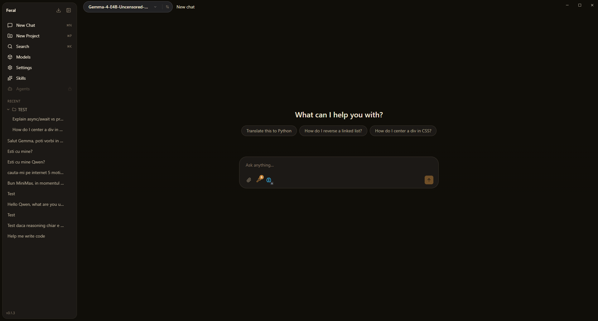
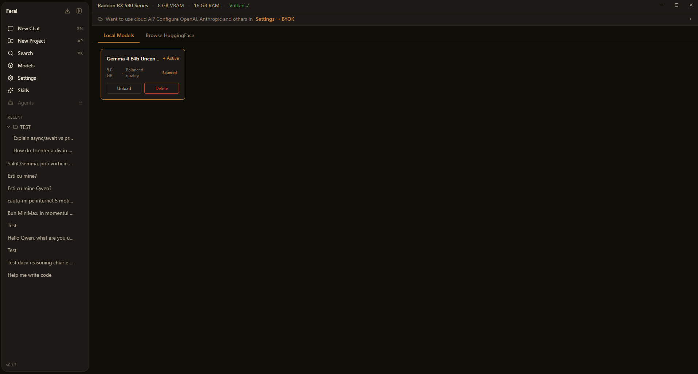
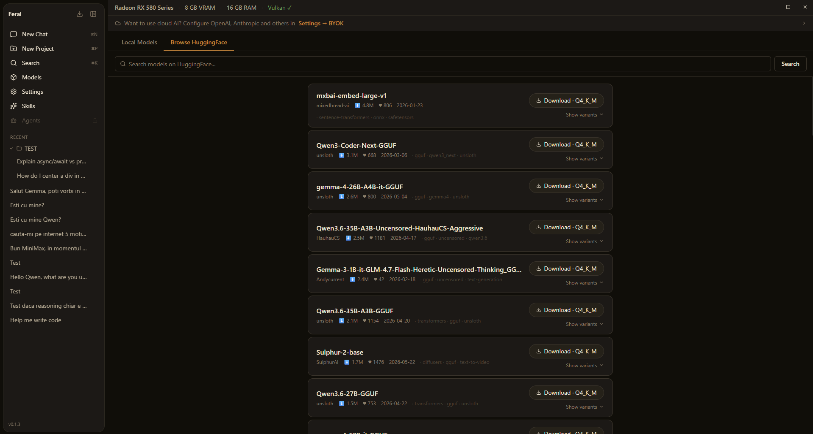
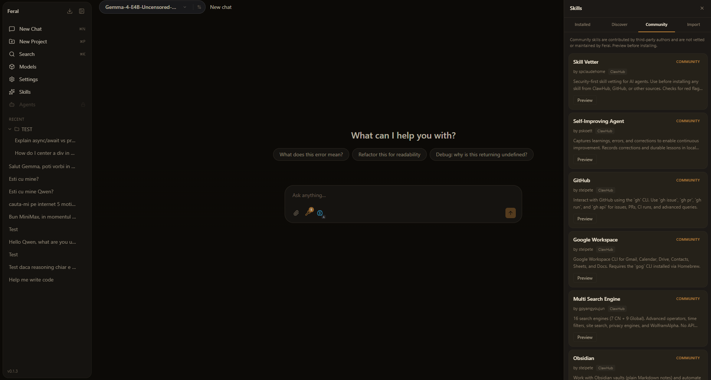
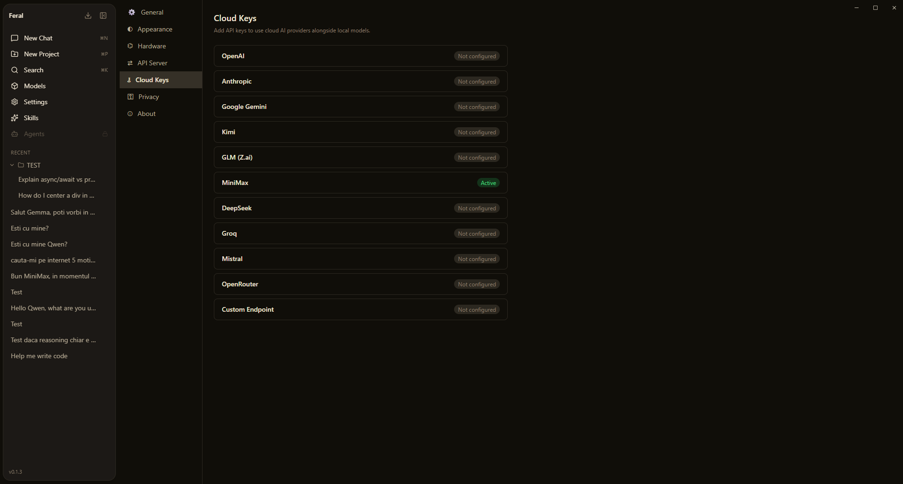

# Feral

**Your local AI workspace. No cloud. No subscription. No compromise.**

[Download for Windows](https://github.com/bloom500/feral/releases/latest) · [Report an issue](https://github.com/bloom500/feral/issues)

---

## TL;DR

Feral is a desktop app that lets you chat with AI models running entirely on your own computer — no internet required, no API bills, no data leaving your machine. You can also plug in your own API keys for cloud models (ChatGPT, Claude, Gemini, etc.) and switch between local and cloud with one click. Think of it as a polished, private AI assistant that lives on your PC and does whatever you need.

---

---

## What's inside

| Feature | Description |
|---|---|
| **Chat** | Persistent conversations with any local or cloud model. Projects keep related chats grouped. |
| **Local Models** | Load GGUF models from disk. One-click load/unload with live Active status. |
| **Browse HuggingFace** | Search and download models directly inside the app — no terminal, no manual file moves. |
| **SkillHub** | Install, discover, and import skills that extend what the AI can do. Community tab ships with curated third-party skills. |
| **Cloud Keys (BYOK)** | Add your own API keys for OpenAI, Anthropic, Google Gemini, Kimi, GLM, MiniMax, DeepSeek, Groq, Mistral, OpenRouter, or any custom endpoint. |
| **Hardware Monitor** | Live GPU/VRAM/RAM readout and Vulkan detection in the title bar — always know what your machine is doing. |
| **Auto-updater** | Silent background update checks. One click to install the latest version. |

---

## Screenshots

### Chat

### Models — Local

### Models — Browse HuggingFace

### SkillHub

### Cloud Keys

---

## Why Feral

Most AI desktop apps are Electron wrappers — heavy, slow, and built around a single cloud provider. Feral is different:

- **Native binary.** Built with Rust + Tauri v2. Fast startup, low RAM, no Chromium tax.
- **Local-first.** Connect to Ollama or llama.cpp. Your conversations stay on your machine.
- **Flexible.** BYOK support for 10+ cloud providers means you're never locked in.
- **Extensible.** SkillHub lets you install agent skills that give your models new capabilities.
- **Honest UX.** No dark patterns, no upsells, no telemetry. Just the tool.

---

## Tech stack

| Layer | Technology |
|---|---|
| Backend | Rust + Tauri v2 |
| Frontend | React + TypeScript + Vite |
| Styling | Tailwind CSS |
| Local inference | Ollama / llama.cpp (via REST) |
| Model discovery | HuggingFace Hub API |
| Signing & updates | tauri-plugin-updater + minisign |

---

## Getting started

1. Download the latest installer from [Releases](https://github.com/bloom500/feral/releases/latest)
2. Run the setup — no admin rights required
3. Open Feral, go to **Models** and either load a local GGUF file or browse HuggingFace to download one
4. Start chatting

For cloud models: go to **Settings → Cloud Keys** and paste in your API key for any supported provider.

---

## Roadmap

- [x] Chat with local models (Ollama / llama.cpp)
- [x] HuggingFace model browser and downloader
- [x] SkillHub — install, discover, and import agent skills
- [x] BYOK cloud keys (10+ providers)
- [x] Live hardware monitor (GPU / VRAM / RAM)
- [x] Auto-updater
- [x] Projects and conversation history
- [ ] Agents — autonomous workflows with tool execution, memory, and skill loops
- [ ] Local API server — expose a local endpoint for other apps to consume

---

*Built by [Bloom Lab](https://github.com/bloom500) · MIT + Apache 2.0*
