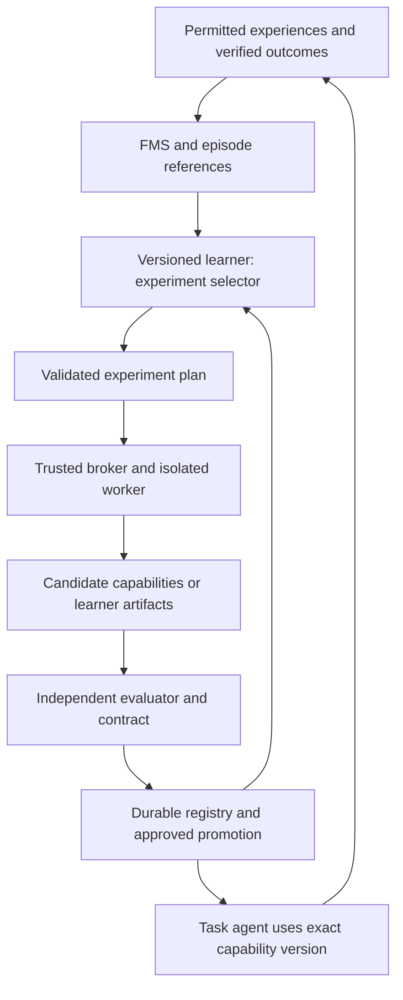

# Cinderpaw: recursive learning with measurable transfer

Date: 2026-09-12
Status: proposed design for user review; no implementation or license change authorized by this document.
Source baseline: `57fe1da52f2b8f5947f2d7b797ed6f22995cbaa9`.
Task branch: `docs/recursive-learning-spec-20260912`.

## 1. Decision and ambition

Build a bounded, experimentally testable recursive learning system on the existing BRSI substrate. Its first mutable learning algorithm selects experiments. Successful successors must participate in discovering later successors, and must outperform a frozen learner under equal total resource limits on unseen tasks.

The product objective is a personal agent whose acquired competence compounds across projects and sessions. The research objective is to measure whether changing the learner improves subsequent learning. Neither the implementation nor the name establishes AGI, unlimited improvement, algorithmic novelty, or superiority over an entire laboratory.

The first result worth publishing is a reproducible recursive advantage with transfer, retention, and full cost accounting. The first result worth shipping is fewer repeated user corrections on new tasks. Both are required before positioning the system as a major competitive advance.

This spec is deliberately staged. Building all mechanisms simultaneously would make attribution impossible and consume resources before the central hypothesis is tested. Weekly assistant quota is not a compute budget or a reliable estimate of implementation capacity.

## 2. Existing evidence and reuse

Paths below are relative to the repository root. Code observations are from this session; audit findings are attributed to the existing audit and were not reproduced here.

| Existing component | Observation | Design consequence |
|---|---|---|
| `CinderpawAgent/src/rsi/l6-meta/meta-evolution.ts` | Five bounded metaparameters; journal-window fitness | Retain as a hyperparameter baseline, not proof of recursive algorithm improvement |
| `CinderpawAgent/src/rsi/l1-config/champion.ts` | Live projection maps temperature and prompt style; other dimensions explicitly unmapped | Require evaluated artifact identity and behavior to match execution |
| `CinderpawAgent/src/rsi/infra/contract.ts` and `contract-runner.ts` | Existing staged candidate contract | Extend through explicit integration slices; do not build a competing promotion authority |
| `CinderpawAgent/src/rsi/infra/confidence.ts` | Existing paired gate | Reuse only after checking calibration for nested and adaptive experiments; minimum sample constant is not a power analysis |
| `CinderpawAgent/src/rsi/l4-modules/seam-catalog.ts` | Two existing seams: retrieval and planner | Proposed learner seam is an explicit catalog expansion, not an existing API |
| `CinderpawAgent/src/rsi/l4-modules/seam-runtime.ts` | Retrieval wiring exists; planner described as eval-side, not a live agent-loop planner | Do not infer complete eval/live parity from the catalog |
| `CinderpawAgent/src/rsi/l4-modules/module-wall.ts` | Lexical rejection of ambient authority | Defense in depth only; never substitute for OS isolation |
| `CinderpawAgent/src/rsi/infra/envelope-store.ts` and `provenance.ts` | Versioned artifact envelope substrate | Extend existing provenance and fail-loud persistence |
| `CinderpawAgent/src/rsi/l2-adapt/` | Dataset, LoRA pipeline, registry and evaluation modules exist | Weight learning is deferred, not declared absent |
| `audit-out/brsi-l3-l5-l6-astra-2026-09-12.md` | Reports rollback/persistence limits and L3 worktree isolation limits | Prerequisite fixes and regression probes before generated learner code executes |

Read `docs/agents-memory/project_brsi_evolution.md` before implementation. Its dated branch statuses are historical evidence, not proof that a particular fix is on current HEAD. Preserve locked D1-D10 decisions and existing human approval requirements. This proposal does not authorize reopening them.

## 3. Alternatives considered

1. Expand unrestricted self-editing immediately: larger search space, weak attribution and greater operational risk. Rejected for the first experiment.
2. Continue tuning five metaparameters: inexpensive and useful baseline, but cannot test executable learner evolution. Retained as a control.
3. Evolve a narrow, executable learner behind a fixed evaluator: constrained expressivity, strong attribution and incremental implementation. Selected.

The constraint is intentional. After a selector succeeds, test additional learner operations separately. Do not claim unrestricted RSI from a bounded selector result.

## 4. Operational definition and hypotheses

Let `M_g` be the learner at generation g, `A` a task-solving agent, `D` a permitted experience stream, and `B` an enforced total resource budget. `Learn(M_g, A, D, B)` produces task capabilities and evidence. A generation is a learner artifact change, not merely another downstream task solution.

H1: an evolved learner produces better held-out downstream performance than M0 under the same B.
H2: allowing promoted learners to influence subsequent learner search beats continued search with frozen M0. This is the recursive contribution.
H3: the gain survives new repositories/task families and a second pinned base model without additional tuning on the transfer test.
H4: accumulated capabilities improve future user work without unacceptable regressions or increasing corrections.

H1 alone is learner optimization. H2 with executed lineage evidence supports bounded recursive improvement. H3 supports transfer. H4 supports product value. None implies general intelligence or sustained exponential growth.

## 5. Architecture and authority

Three authority domains:

- Mutable candidate: pure selection logic over bounded serialized inputs. No credentials, arbitrary filesystem, network, evaluator code or hidden labels.
- Trusted orchestrator: validates plans, brokers inference with existing spend authority, runs workers, records receipts, enforces promotion and cancellation.
- Independent evaluation domain: holds withheld tasks and verification outputs; candidate cannot mount its filesystem, inspect process state or write scores.

FMS retrieves experiences; it does not certify causes. BRSI evaluates changes; it does not score itself by counting its own accepted journal rows. The task agent uses capabilities; it cannot confer promotion authority on a candidate.

## 6. First learner contract

These are proposed data contracts, not existing TypeScript exports or library APIs.

`LearnerArtifact`: schema version, content hash, parent hash, executable source hash, seam API version, source model/version, generation, evidence references, promotion state, permitted operation set, resource profile.

`ExperimentContext`: sanitized development history, candidate descriptors, bounded archive summaries, available experiment IDs, remaining resource vector, explicit seed, purpose (`capability_search` or `learner_search`). No held-out test contents, credentials or free-form file access.

`ExperimentPlan`: ordered experiment IDs with bounded resource allocations. Each experiment identifies a parent artifact, a host-defined mutation operation and a development evaluation slice. Candidate supplies no shell command, path, new tool, model endpoint or evaluator definition.

`ExperimentReceipt`: plan hash, invoking learner hash, executed artifact hash, purpose, environment/model/tool versions, parent lineage, raw broker usage, wall time, resource measurements, verified result references and terminal reason.

Validation rejects unknown IDs, duplicates where repeated execution is disallowed, non-finite numbers, allocations exceeding available resources, oversized outputs and invalid versions. Invalid plans count as failures with consumed resources retained. The broker never executes partially validated plans.

The selector is executable policy over those descriptors, not just a fixed vector of tunable weights. M0 is a deterministic hand-written policy. Generation uses a pinned LLM through the trusted broker; the selector cannot invoke it directly.

## 7. Closing the recursion

1. M0 chooses experiments that train or improve downstream capability artifacts.
2. For learner search, the same selector contract chooses parents, allowed mutation operations and development experiments for candidate selectors. The pinned proposer generates source; the parent learner influences which proposals receive budget.
3. Each candidate selector is exercised on fresh inner learning streams. Evaluate the capabilities it produces on a separate validation partition.
4. A passing selector becomes promotion-eligible. Actual activation retains existing human-gated L6 policy, with the approval bound to its exact hash.
5. M1 then selects learner-search experiments that can produce M2. Record the selector hash on every broker request and receipt.

The fixed LLM proposer remains external. Describe results as recursive improvement of experiment selection with a fixed proposer; do not claim the system invented its foundation model or autonomously changed every part of learning.

If users reject a scientifically eligible promotion, record a governance stop. Do not silently replace the run, hide it, or make control decisions depend on final-test scores.

## 8. Capability and experience contract

Start with one coding family: diagnosing and repairing build/configuration failures in isolated fixture repositories. Hold out whole repositories and failure templates, not paraphrases of the same task. Fixtures must run without access to a user's live files.

`CapabilityArtifact`: content hash, parameter schema, applicability conditions, bounded procedure, required tool IDs, pre/postconditions, recovery behavior, evidence scope, dependency hashes and retirement state. An artifact may be a procedure or module; it is not automatically a LoRA adapter.

The evaluator and task execution resolve the same immutable artifact and adapter version. Log the resolved hash. Reject unsupported fields rather than evaluating knobs that disappear in live execution.

Experience records distinguish observed state, action, verified outcome and proposed explanation. A post-hoc explanation is a hypothesis. Causal improvement is supported by controlled comparisons, not by an LLM labeling a memory causal.

Extend existing envelopes and episode references through the single-writer contract. The initial research runner uses an explicit campaign directory and sanitized fixtures. No production memory schema migration is included in this document change. Later migration slices require the memory roadmap and recovery design.

Composition is a later gate: combine two validated capabilities on unseen tasks, reject incompatible contracts, and fall back to the unchanged task agent. Cross-user capability import always revalidates; personal episodes are not copied with a skill.

## 9. Evaluation protocol

### 9.1 Partitions and leakage

Freeze a campaign manifest before confirmatory runs: dataset/version hashes, family-level split, model versions, prompts, tools, environment image, arm definitions, seeds, budgets, primary comparison and statistical procedure.

Use separate development, promotion-validation, final-test and transfer partitions. Candidate generation sees only development data. Repeated access to promotion outcomes is treated as adaptive validation; cap eligibility attempts and spend the registered error budget across attempts. Final-test results are revealed once after all compared lineages and artifacts are frozen.

Retire a final set from confirmatory status after exposure. Synthetic task generators and near-duplicate templates must be grouped before splitting. Unknown base-model training contamination is disclosed; fresh private fixtures reduce but do not prove its absence. Keep final task IDs and seeds out of candidate inputs.

### 9.2 Arms

| Arm | Purpose |
|---|---|
| Fixed task agent, no learning | Product baseline |
| Fixed M0 learner with persistent capability archive | Benefit of ordinary continual learning |
| Current five-parameter L6 path, adapted to identical harness | Hyperparameter baseline |
| Random experiment selection with same proposer/archive | Strength of cheap search baseline |
| Frozen M0 searches learner candidates; successors may improve task learning but never control learner search | Non-recursive learner-search control |
| Promoted M_g also controls learner search | Recursive treatment |

All search arms share initial artifacts, permitted operations, proposer, information access and resource caps. Memory/archive growth is matched; frozen does not mean deprived of history. The primary H2 comparison is recursive versus non-recursive learner search. The H1 comparison uses fixed M0.

An additional swap ablation installs a discovered selector into a fresh identical archive. It tests whether the artifact transfers benefit beyond accumulated archive quality. Resetting the selector to M0 while retaining the treatment archive probes how much gain resides in selection versus memory.

### 9.3 Measurement and uncertainty

Primary metric: held-out task success at the registered total compute cap. Secondary metrics: area under the success-versus-cumulative-cost curve, total dollars, input/output tokens, worker CPU/GPU time, wall time, verification cost, invalid proposals, repeated corrections and retained-task success.

Count generation, dreaming, discarded candidates, memory rebuilds, retries, final evaluation and baseline tuning. Report fixed final-evaluation overhead separately as well as in the total. Local inference has zero API billing, not zero compute cost. Require both a compute-matched comparison and a reported dollar-cost comparison; do not equate hardware seconds across unlike accelerators.

Use paired campaign seeds and task/environment snapshots. The independent unit is a complete learning run, not each correlated task answer. Report run-level uncertainty and per-family results. Calibrate inference using simulated no-effect runs; do not reuse the current bootstrap tail probability as a validated p-value without checking it.

Pilot: five paired seeds, at most three successor generations, at most eight candidate selectors per generation. This estimates variance and engineering cost; it cannot authorize a superiority claim. Confirmatory sample size is determined from pilot run-level variance before final access, with at least ten paired runs and 80% planned power for the registered meaningful effect. If the funded sample cannot meet that plan, label the result inconclusive.

Proposed meaningful effect: at least five percentage points of final success improvement over the primary control, with a 95% confidence interval excluding zero and correction for registered multiple primary comparisons. Preserve existing strict promotion thresholds as additional gates. Retention margin: no more than two percentage points lost on the reserved prior-task set, assessed with an appropriate one-sided interval. These are proposed campaign decisions, not changes to locked project policy.

For H3, repeat frozen artifacts on one unseen task family and a second pinned model; compare against that model's own matched M0. Do not tune on transfer outcomes. A single successful lineage illustrates behavior but does not establish H2.

### 9.4 Promotion versus exploration

Keep a bounded research archive of diverse candidates, including useful non-champions. Archive admission is not production approval. Production uses only a validated, approved champion, with the baseline available. Every rejected or stopped run remains in the manifest.

Stop the campaign on exhausted budget, broken isolation, compromised evaluation, irreproducible artifact identity or failed recovery. Plateau after the registered generation cap is a result, not permission for unlimited compute. If H2 fails, retain useful H1 artifacts but label the system non-recursive learner optimization.

## 10. Execution, persistence and recovery

Generated learner code runs in a disposable Linux VM with no host-directory mounts, no credentials, disabled external networking, read-only runtime and bounded scratch disk. Use one VM per paired evaluation arm or restore a verified snapshot between them. Selecting a particular hypervisor/backend requires a feasibility slice against documented APIs; this spec does not assume one is installed.

The selector exchanges bounded JSON with a trusted broker. Pin runtime dependencies and disable runtime package installation. Enforce CPU, memory, disk, output and wall limits outside the candidate. Terminate the entire VM on cancellation; a child-process timer alone is insufficient. Unsupported isolation means no generated-code execution, not a worktree fallback.

The evaluator resides outside candidate access. Hidden tests are run by its own worker and produce broker-attested outcomes, not candidate-written success logs. File hashes establish identity, not safety. Protect governance, spend authority, evaluator, approval verifier and seam creation in both TS and Rust enforcement paths.

Activation protocol: persist immutable artifact and evidence, durably record an approved pending activation, atomically publish the active pointer, then expose the version to new requests. In-flight work retains its original version. Crash recovery reconciles the recorded activation and pointer before accepting work. Unwritable evidence prevents activation; do not deploy only in memory.

Freeze stops evolution and candidate execution but must not block an authorized recovery to a recorded safe version. Corrupt or missing active artifacts resolve to the built-in learner with a visible recovery event. Preserve evidence and quarantine the broken artifact. Rollback changes future behavior; it does not undo external real-world actions.

Test disk-full, interrupted writes, restart between each activation step, frozen rollback, malformed plans, infinite loops, process spawning, attempted host reads, network access, score forgery and hidden-test access. Treat the September 12 audit findings as prerequisites to verify, not fixed facts.

## 11. Resource authorization

No paid run, background campaign, cloud deployment or license change is authorized by writing this spec. Before any campaign, the human supplies a nonzero absolute USD ceiling and machine-time ceiling in its manifest. Without them, only deterministic fixture tests may run. Existing unknown-price fail-closed and pre-request reservations must be verified at the actual inference route.

Reserve resources for both arms and final evaluation before starting a paired run. Failures retain their spend; do not rerun until successful. Estimate pilot cost from a measured single fixture and the nested plan, including all inner learning runs, before proposing the full pilot budget. Stop if the authorized cap is reached; reduced power must be disclosed.

Implementation effort and research success are separate. A correct runner can yield a negative scientific result. Do not estimate completion from weekly assistant quota.

## 12. Product advantage under Apache 2.0

Apache permits compliant commercial reuse and proprietary forks. Copying permitted code is not theft under that license. No algorithm architecture can make public source intrinsically uncopyable. This spec does not change the current BUSL license.

The proposed defensibility is cumulative and uncertain:

| Asset | How it could compound | Honest limit |
|---|---|---|
| Consented longitudinal workflows | Reveal recurring user problems and useful transfer opportunities | Users own their data; no silent collection or claim of exclusive access |
| Verified capability histories | Establish when a skill works, its regressions and compatibility | Published artifacts can also be copied |
| Trusted release and evaluation practice | Reduce user risk through reliable updates and visible evidence | Competitors can reproduce the practice |
| Integrations and maintainer community | Broaden distribution and task coverage | Requires sustained support and actual adoption |
| Managed operation and support | Monetize reliable running, administration and recovery | A larger provider can offer alternatives |

Personal histories stay local by default. Shared capabilities require explicit export, secret/provenance checks and recipient-side validation. Telemetry and research participation are opt-in and revocable; specify deletion and derived-artifact handling before collecting data. Personalization should survive a model/provider change through portable artifacts, not customer lock-in.

Do not wait for a grand RSI claim to start distribution. Ship the first validated capability with a before/after demonstration, publish the reproducible protocol and measured limitations, and recruit a small opt-in pilot around recurring coding workflows. Track repeat usage, correction recurrence and retained-task success over time. Expansion requires useful product evidence, not just repository stars.

Before a permissive release, make an explicit business decision: accept competitors' reuse in exchange for ecosystem access, or retain current licensing while validation proceeds. Public priority records and branding support attribution; they do not prevent authorized copying. Do not promise a moat that exists only because private user data is hard to export.

## 13. Comparison with Sakana and claim discipline

DGM already reports self-modification ablations and transfer across models and programming languages. Neither a recursive diagram nor a transfer test is by itself a new contribution. ShinkaEvolve already targets sample-efficient program evolution. This proposal's hypothesis is an integrated advantage in nested learner improvement, longitudinal personal tasks, full cost accounting and governed execution. It remains a hypothesis.

Use pinned official DGM and ShinkaEvolve revisions as additional comparators after the internal harness is valid. First reproduce a supported upstream example. Then document every adaptation needed for the common task, including proposer, budget, tools, archive and evaluator. An adapted baseline must be labeled as such; a home-grown imitation cannot be presented as official DGM performance.

Report native upstream and common-harness results separately. Give every baseline a predeclared tuning budget. If an upstream dependency/model is unavailable, mark the comparison unavailable and preserve the internal result; do not substitute historical percentages from unrelated datasets.

Allowed claim ladder:

1. Engineering: reproducible isolated learner experiments and recovery pass.
2. Learning: H1 passes, with full costs and uncertainty.
3. Bounded RSI: H2 passes and receipts show successors controlling successor search.
4. Transferable bounded RSI: H3 passes.
5. Product benefit: H4 passes in an opt-in longitudinal study.
6. Competitive result: a named pinned comparator is exceeded on named tasks and budgets.

No rung authorizes “above all labs,” “AGI,” “unlimited self-improvement,” or a claim that competitors lack private mechanisms. A failed hypothesis must remain publishable.

## 14. Implementation sequence and acceptance

Each row is a milestone, not permission for one large commit. Before implementing a milestone, produce its concrete file-level slices. Each slice changes at most three files, including tests and memory updates; if a coherent slice cannot fit, request the explicit repository-rule exception. Keep one task branch and conventional commit per logical change. Existing unrelated work is excluded.

| Milestone | Scope and likely existing boundary | Acceptance before next milestone |
|---|---|---|
| S0: trust prerequisites | Audit recovery paths, budget routing, L3 isolation, protected TS/Rust authority | Reproduced findings fixed in separate slices; crash/isolation probes pass |
| S1: campaign and paired runner | Existing eval/budget/provenance interfaces; new research-only runner | Deterministic fixtures, matched cost ledger, partition isolation and null-effect calibration pass |
| S2: artifact parity | L4 registry/seam adapter and capability invocation | Same hash and semantics in eval and execution; rollback/restart tests pass |
| S3: fixed learner | New experiment-selection contract, M0 and random baseline | Reproducible downstream learning on fixtures without recursive promotion |
| S4: learner evolution | Explicit catalog expansion and L6 integration through existing contract | Candidate evaluation uses inner learning; approved activation is durable and observable |
| S5: recursive experiment | Successor controls learner-search plans; matched non-recursive arm | Pilot receipts prove actual recursion; confirmatory protocol frozen before test access |
| S6: transfer and external baselines | Frozen artifacts; second model/family; official comparator adapters | H1-H3 and comparator claims reported separately with uncertainty and full costs |
| S7: product pilot | One coding capability family and consented outcome tracking | H4 evaluated; visible version, evidence, recovery and retained competence |

Weight training, new foundation models, unrestricted self-editing, cross-user federated learning, new task species and a universal world model are outside the first program. Retain research/coding species policy. Do not modify voice/audio files, `mcp.json` or unrelated connectors. A license migration is its own task.

## 15. Review decisions and validation status

User review is required before implementation: approve or amend selector-first scope, proposed effect/retention thresholds, VM-only candidate execution, and the phased claim ladder. This is a draft spec, not evidence these decisions or a spend budget were already approved.

Spec self-review: checked consistency of recursive authority, matching controls, final-set isolation, cost accounting, artifact parity, crash recovery, existing locked decisions and permissive-license limits. No code was implemented and no scientific experiment was run.

Repository gate attempted on 2026-09-12: `bash ./scripts/verify.sh` exited 1 before tests because the installed Windows WSL launcher could not execute `/bin/bash`. Therefore the required full gate is BLOCKED, not PASS. No implementation correctness or green-build claim is made. Restore a working Bash/toolchain and rerun the exact gate before treating an implementation slice as complete.

## 16. Sources

- Local: `docs/agents-memory/project_brsi_evolution.md`; `docs/agents-memory/project_memory_roadmap.md`; `audit-out/brsi-l3-l5-l6-astra-2026-09-12.md`; source paths listed in section 2; `LICENSE`. Historical notes are not current runtime verification.
- Sakana, DGM, published May 30, 2025: https://sakana.ai/dgm/ (accessed 2026-09-12).
- Sakana, ShinkaEvolve, published September 25, 2025: https://sakana.ai/shinka-evolve/ (accessed 2026-09-12).
- Official ShinkaEvolve code: https://github.com/SakanaAI/ShinkaEvolve (pin at campaign preparation; no revision chosen or executed in this spec).
- Apache License 2.0: https://www.apache.org/licenses/LICENSE-2.0 (license rights, not a business-success prediction).

These sources establish prior art and license terms. Proposed architecture, thresholds and competitive hypotheses are Cinderpaw design choices, not conclusions borrowed from those sources.
